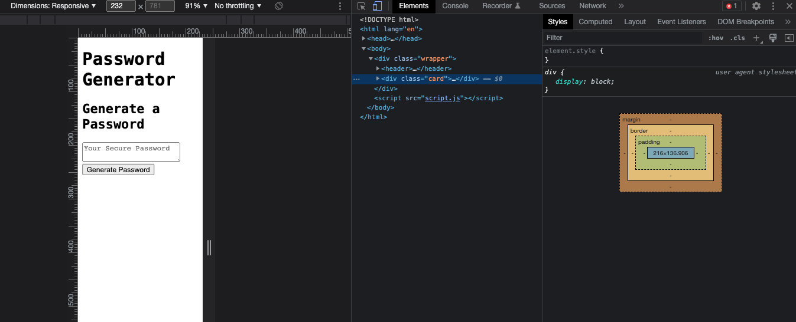

# password-generator

## Description
JavaScript password generator

## Installation
To view the project in your browser:
1. You will need to clone down the repository from GitHub to your local machine. 
2. Once you have the project locally, you will need to open it in VSCode IDE. Right-click on the `index.html` file, then select `default browser` from the dropdown menu. This will open the HTML page in the broswer of your choice.

## Deployment

Application is deployed through Github Pages, live URL [Portfolio Website Link](https://westgards.github.io/password-generator/src)

## Features
- Dynamically updated HTML, CSS, and JavaScript
- Responsive user interface that adapts to multiple screen sizes
- Random passwords can include special characters 

## Credits

Tutorials:

[U of MN Coding Bootcamp Link](https://github.com/coding-boot-camp)

## License

Licensed under the MIT license. [MIT license Repo Link](https://github.com/westgards/portfolio/blob/main/LICENSE) license.
